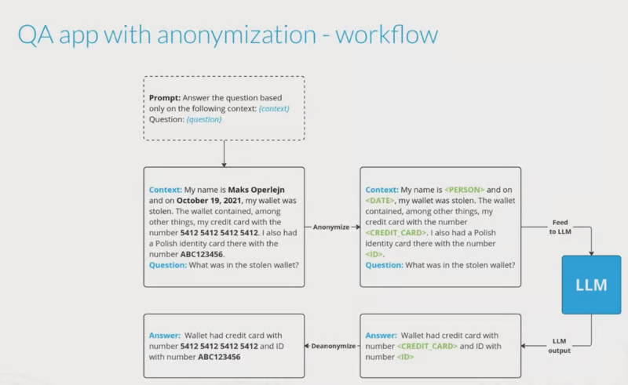

# Data anonymization for LLMs with OpenAI, LangChain and Microsoft Presidio
Developing and Exploring Use cases for Reversible Anonymization, Multi-language Anonymization, Question and Answering with privacy protection.

